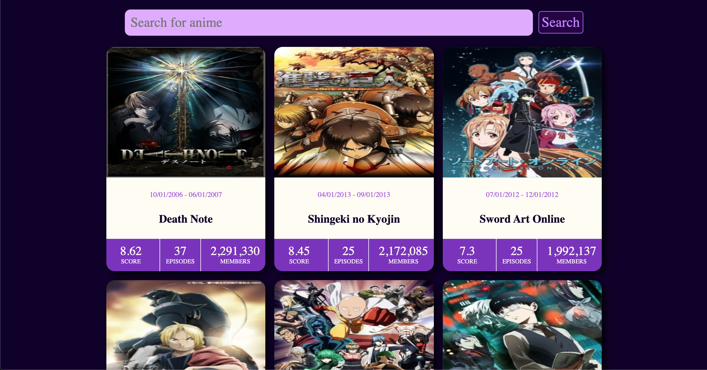
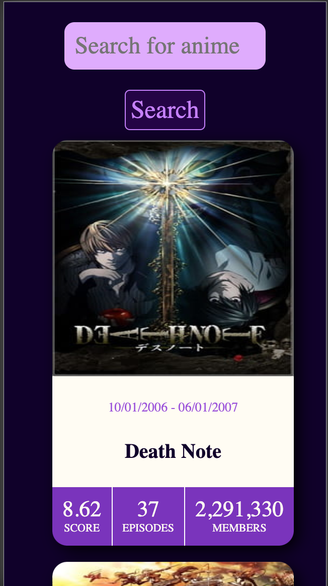

# Anime Search App Created With React and Redux

Anime search tool to find more information about your favorite anime.

---

## Live Version

Website is hosted on [gh-pages](https://ozansozuozgit.github.io/anime-search-react/)

  

  

## Tools used

- React Core
- Redux Toolkit
- Framer Motion
- CSS Modules
- [jikanjs](https://github.com/zuritor/jikanjs)
